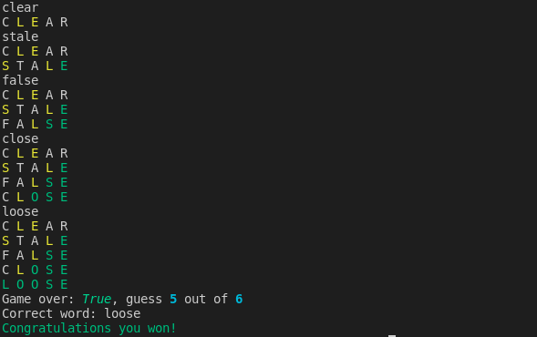
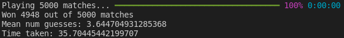

# Ngram-wordle

### Playing the game manually   

Running ```python game.py``` will start a manual game with a randomly selected word (from the 2315 words list).

Guessing valid 5 letters words will show the result of each guess.
Game will finish when the correct word is guessed or when the player reaches 6 incorrect guesses.  



### Running the tester

The tester is used to automatically run many games given a particular solver class. The number of games won, average number of guesses and the time taken to play the games are shown. Run using ```python tester.py [WORD_LIST_FILEPATH]``` where the first argument points to the filepath for the words list.    



### Create wordle solver using ngrams
- [x] Read file of all possible 5 letter words
- [x] Write wordle game logic, enum for guess states
- [x] Develop pruning word list algorithm for playing game, starting off with random
- [x] Score word list by frequency of letters
- [ ] Score based on position of letter
- [ ] Use ngrams for sorting 
- [ ] Create RL game framework
